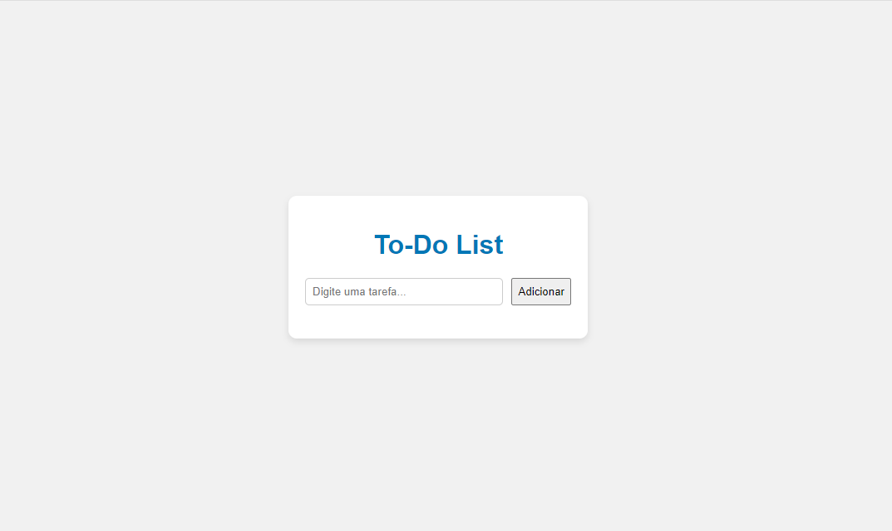

# To-Do List

Um projeto simples de lista de tarefas desenvolvido com **HTML, CSS E JavaScript**.
Permite adicionar, concluir e excluir tarefas de forma interativa.

## Funcionalidades
- Adicionar novas tarefas.
- Marcar tarefas como concluídas (riscar).
- Excluir tarefas com um clique.
- Interface simples e responsiva.

## Demonstração

## Tecnologias
- HTML5
- CSS3
- JavaScript (DOM)

## Estrutura do projeto

todo-list/
|--index.html
|--style.css
|--script.js
|--README.md

## Deploy
[Clique aqui para acessar o projeto] (https://paulaads.github.io/todo-list/)

## Autor
Paula Renata de Oliveira
[LinkedIn] (https://www.linkedin.com/in/paula-renata-475aa81b4/) | [GitHub] (https://github.com/PaulaADS)
